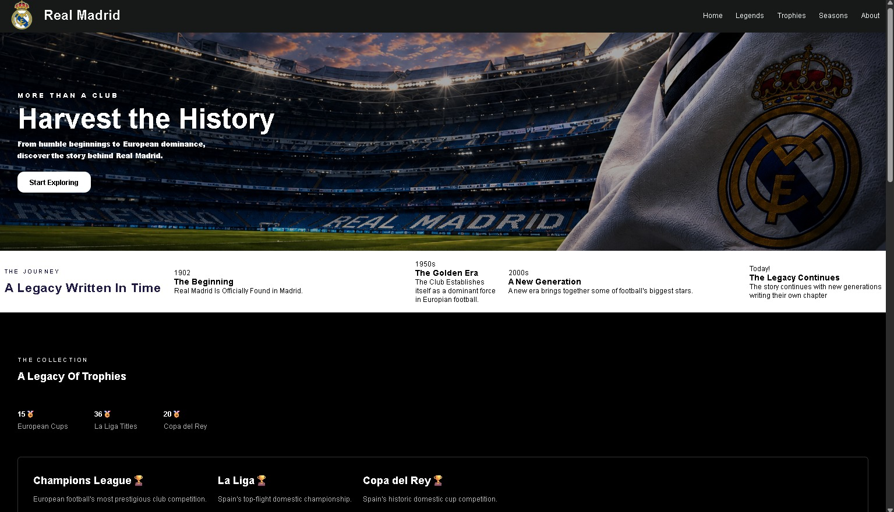
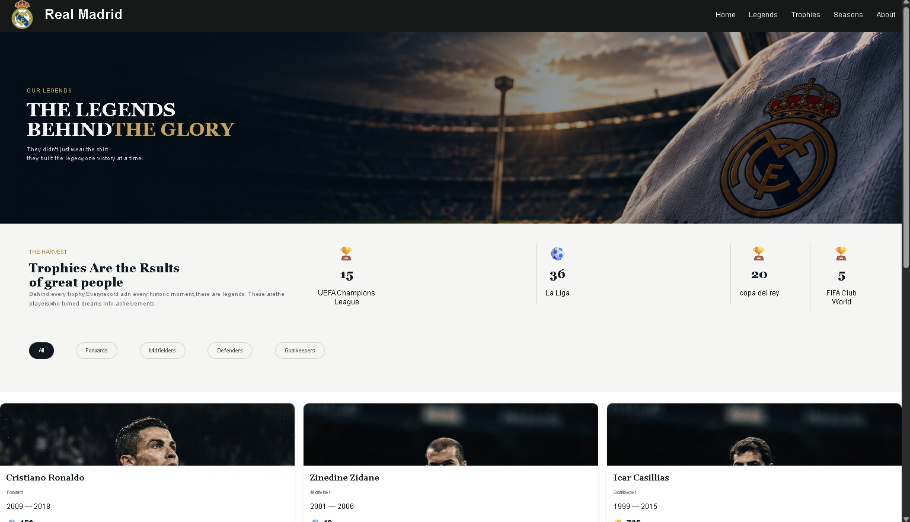

# Real Madrid

This website is demonstrate Real Madrid's history, legends and trophies

    

    

## Overview

Real Madrid, founded in 1902, is one of the most successful football clubs in history. Based in Madrid, Spain, the club is famous for its rich history, iconic white jersey, and success in both Spanish and European football.

Over the years, legends such as Alfredo Di Stéfano, Raúl, Zidane, Cristiano Ronaldo, Casillas, and Sergio Ramos have helped shape the club's identity and legacy.

This project explores Real Madrid's history, trophies, legendary players, and memorable eras.

## Team

Real Madrid Web is being developed by:

Samir Tamer => Legends and Seasons pages

Seif Hussein => Home and Trophies page

## Tech used

- HTML
- CSS
---
## Teams Work

### Sam5 Tamer
I've worked in the web in each HTML and CSS in 2 of 4 pages in the Project (Legends and Seasons) and brought the pictures for my Pages.
